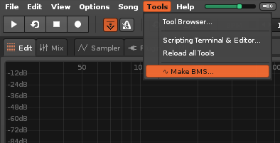
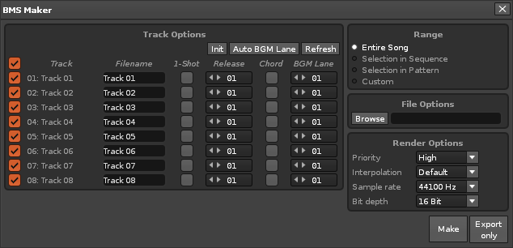
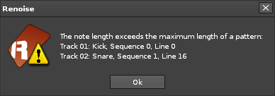
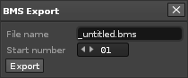
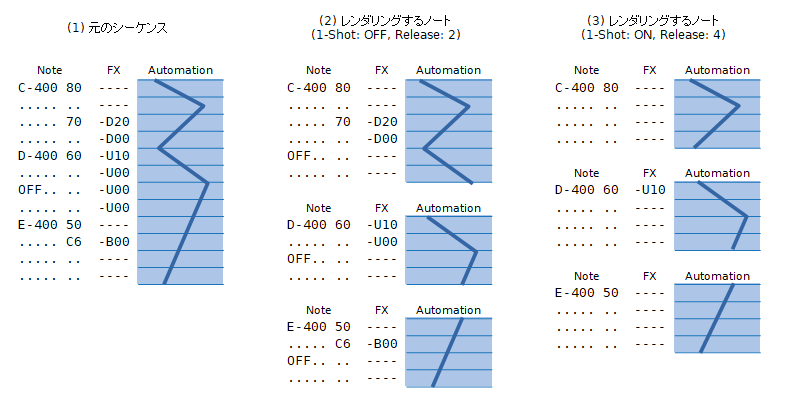
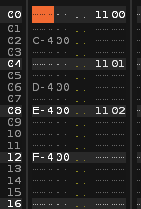
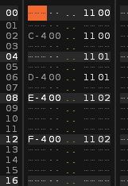
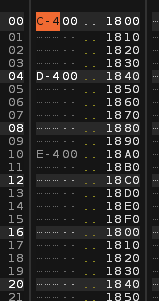
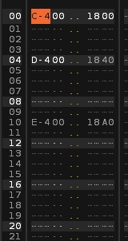
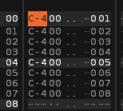

# Renoise-BMS-Maker
BMS creation support tool for Renoise

## 機能
* BMS 制作時の音切り工程を行う。すなわち、それぞれのノートを単音の音声ファイルで書き出し、
それらを BMS フォーマットで元のシーケンスを再現する。
* ソングファイルのトラックのうちの一つ以上を選択し、それらのトラック内にあるノートに対して音切りを行う。
* WAV 定義とシーケンスデータを含む BMS ファイルを出力する。
* オートメーションを含むトラックも再現することができる。
対象となるオートメーションのトラックは、指定されたシーケンサートラックと、
そのシーケンサートラックを含む全てのグループトラックと、マスタートラックである。
* 同じノートに対して同じ wav ファイルを使用することで、WAV 定義数と全体のファイルサイズを削減する。

## 注意事項
* デバイスパラメータの変化の再現は、オートメーションのみ対応している。
コマンドには基本的には対応していないが、対応できる場合も存在する (Tips を参照)。
オートメーションの補間方式は Curve には対応していない。
また、BPMのオートメーションの補間方式は Points でなければならない。
* LFO を持つデバイスの正しい位相の再現は基本的にはできないが、
対応できる場合も存在する (Tips を参照)。
* Maybe コマンド、ランダムLFO、Plugin Instrument のランダムなパラメータなどのランダム性の再現はできないが、
同じノートを違う wav ファイルにすることで、同じ音が繰り返し使われることを防ぐことができる (Tips を参照)。
* センドトラックのオートメーションの再現はできない。
* Delay コラム、Delay コマンドを使ったノートの正しい位置での音切りには対応していない。
* Glide To Note コマンド、Instrument のグライド機能のピッチ変化の再現はできない。
* Arpeggio コマンド、Retrigger コマンドのエフェクトによる発音位置での音切りはできない。
* Phrase 内のノートの音切りはできない。
* サイドチェインなどの他のトラックの信号を使ったデバイスパラメータ変化の再現はできない。
* Pattern の最大ライン数である 512 ライン以上のノートのレンダリングはできない。

## 必要なもの
* [Renoise 3.2](http://www.renoise.com/ "Home | Renoise")

## インストール方法
1. [Releases](https://github.com/raii-x/Renoise-BMS-Maker/releases "Releases · raii-x/Renoise-BMS-Maker") のページから、最新のバージョンの xrnx ファイルをダウンロードする。

2. ダウンロードした xrnx ファイルを Renoise で開く。

## 使い方
1. Tools メニューから Make BMS... を選択する。  

2. BMS Maker ウィンドウで各種設定をする。  

    * Track Options: 音切りするトラックごとの設定
        * 上部のボタン
            * Init:  
            各トラックの設定を初期化する。

            * Auto BGM Lane:  
            各トラックの BGM Lane をトラックの有効・無効、Chord 設定、Note コラム数から自動で設定する。

            * Refresh:  
            トラックがリネーム、追加、移動、削除などで変更された場合には、このボタンを押すことで変更を反映できる。

        * トラックリスト
            * 左のチェックボックス:  
            オンにしたトラックは有効となり、音切りの対象とする。見出し部のチェックボックスは、オンにすると全てのトラックがオンになり、オフにすると全てのトラックがオフになる。

            * Track:  
            設定の対象のトラック名が表示される。

            * Filename:  
            wav ファイルの名前を指定。ここで指定した文字列の後に `_***.wav` がつけれられたものがファイル名となる。`***` は3桁の数字である。

            * 1-Shot:  
            オンの場合、長さの異なるノートでも同じノートとして扱う。ドラムなどではオンにするとよい。

            * Release:  
            1-Shot がオフの場合、ノートオフの後にレンダリングするライン数を設定。オンの場合、レンダリングするノート自体のライン数を設定。

            * Chord:  
            オンの場合、同時に発音する複数のノートをまとめて一つのノートとして扱う。コード系の楽器を一つのノートで鳴らしたいときにオンにするとよい。

            * BGM Lane:  
            BMS ファイルを書き出す際に、そのトラックのノートを置く BGM レーン番号を設定。

        * Prev, Next: トラック数が多い場合にページを切り替える。

    * Range: 音切り対象にする範囲の設定
        * Entire Song:  
        ソング全体

        * Selection in Sequence:  
        Pattern Sequencer で選択している範囲
        
        * Selection in Pattern:  
        Pattern Editor で選択している範囲。レンダリング時には選択範囲のトラックではなく、Track Options で指定したトラックが使われることに注意。

        * Custom:  
        Sequence 番号と Line 番号を直接指定

    * Destination: wav ファイルを出力するディレクトリを指定。Browse ボタンから選択することもできる。

    * Render Options: レンダリング時の設定。Renoise の Render to Disk の設定と同じ。

3. BMS Maker ウィンドウの Make ボタンを押し、音切りされた wav ファイルを出力し、BMS 出力に移る。または、Export only ボタンを押し、wav ファイルの出力を行わず、BMS の出力に移る。  
  
ここで、このエラーが表示される場合は、レンダリングするノートが長すぎるため wav ファイルを出力することができない。それらノートの開始位置のトラック、シーケンス番号、ライン番号が表示されている。ノートオフを入れるか、1-Shot にチェックを入れることで修正できる。

4. BMS Export ウィンドウで、BMS ファイルを出力する。  

    * File Name:  
    出力する BMS ファイルの名前を指定。

    * Start Number:  
    BMS の WAV 定義の開始番号を指定。

    * Export:  
    BMS の出力を行う。

## 音切りの動作について
Track Options で指定された設定に基づいて各トラックを解析し、レンダリングするノートのデータを調べる。レンダリングの際は、ソングの最も上に新しいパターンを作り、ノートのデータを置いてレンダリングすることをノートの数だけ繰り返す。

例として、図の (1) のようなシーケンスに対して処理すること考える。

1-Shot がオフ、Release が 2 の場合、図の (2) の 3 つのノートがレンダリングされる。1-Shot がオフの場合、ノートがあるラインから、次のノートの 1 つ上のラインか、次のノートオフの 1 つ上のラインか、Volume コラムか Panning コラムに Cx コマンドがあるラインまでが 1 つのノートとしてみなされる。レンダリングの際は、1 ノートの範囲の Note コラムと FX コラムのデータを使い、その後ろにノートオフを置き、ノートとその後の Release ライン数を書き出す。その際、書き出すライン数分のオートメーションのデータも使われる。ここで、ノートオフとその後のラインのコマンドは使われない。

1-Shot がオン、Release が 4 の場合、図の (3) の 3 つのノートがレンダリングされる。1-Shot がオンの場合、ノートがあるラインのみが 1 つのノートとしてみなされ、その後のコマンドは使われない。レンダリングの際には、Release ライン数が書き出され、そのライン数分のオートメーションも使われる。

レンダリングする際に使われるノートのデータが全く同じ場合は、それらを同じノートとして扱い、wav ファイルと定義番号を共有する。ここで多重定義は行われないので、必要なら手動で行うか、[Mid2BMS](http://mid2bms.web.fc2.com/ "Mid2BMS BMS Improved Development Environment") の自動重複定義などを利用すると良い。

## Tips
ノートのレンダリング時には、ソングの先頭に新しくパターンが作られ、各ノートのシーケンスがパターンの先頭に書き込まれてレンダリングされる。そのため、デバイスパラメータのコマンドのような、コマンドを入力した位置以降に効果が続くようなコマンドは、レンダリングされるノートのシーケンスの先頭にそのコマンドが含まれない場合、ソングの最初に出現するコマンドの効果が使われる。これを意識して各ノートにコマンドを入力することで、音切り時にコマンドの効果を再現することができる。

### デバイスパラメータのコマンド
デバイスパラメータのコマンドは、ノートの開始位置の全てに正しいパラメータを設定するコマンドを入力することで、音切り時に正しく再現される。

上の画像のようなシーケンスの場合、

上の画像のようにコマンドを入力することで、音切り時に正しく再現される。

### LFO を持つデバイスの位相の再現
LFO デバイスや、Chorus、Flanger、Phaser デバイスのような LFO の位相の値を設定することができるコマンドを持つデバイスは、ノート開始時の位相が正しくなるようにコマンドを入力することで、音切り時に位相を再現できる。

LFO デバイスの Frequency が 16 LPC の場合、上の画像のように LFO の位相を設定するコマンドを毎ライン入力するか、

上の画像のように、ノートの開始位置に LFO が正しい位相になるようにコマンドを入力することで、音切り時に位相が再現される。

### ランダム性を含むノート
各ノートは、シーケンスの内容がコマンドも含めて全く正しい場合のみに同じ wav ファイルが使用される。これを利用して、効果のないコマンドを各ノートにそれぞれ異なるように入力することで、それぞれのノートが別々にレンダリングされ、異なる wav ファイルが使用される。このようにして、ランダム性を含むノートに対して同じ音が繰り返し使われることを防ぐことができる。

上の画像のようにコマンドを入力することで、それぞれのノートを別々にレンダリングする事ができる。
